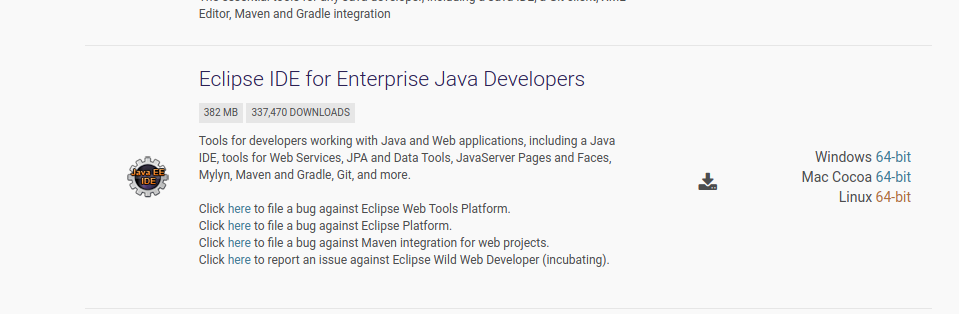
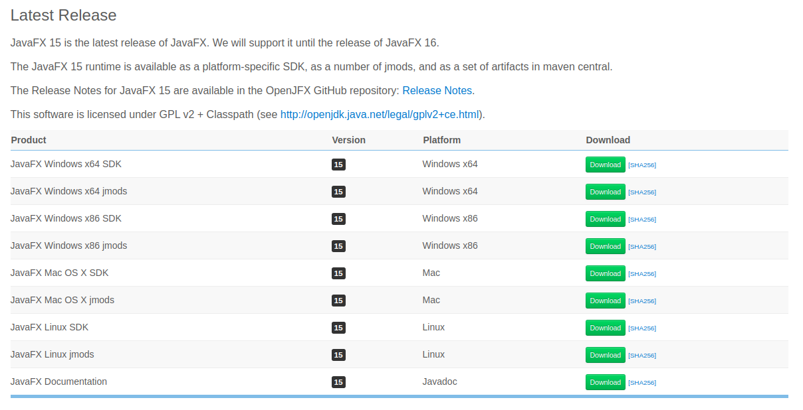
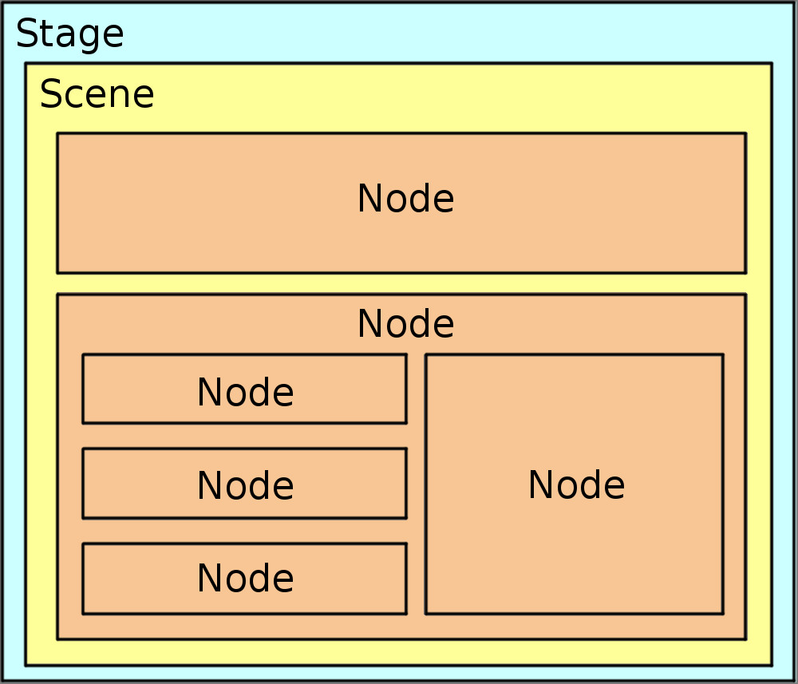
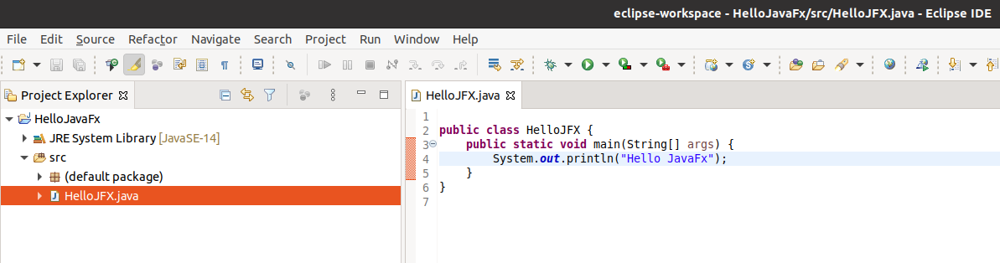
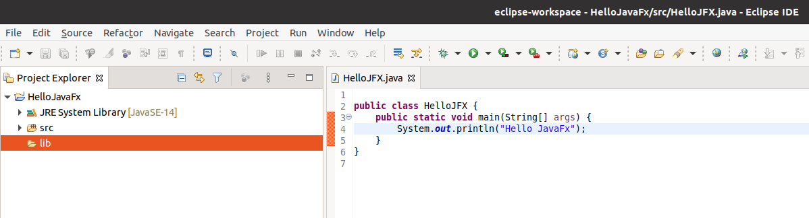

# JavaFx Guidlines

## 1. Tổng quan về JavaFx
- > JavaFX is a set of graphics and media packages that enables developers to design, create, test, debug, and deploy rich client applications that operate consistently across diverse platforms.

- JavaFx là thư viện mã nguồn mở, bao gồm một tập các packages cho phép lập trình viên thiết kế, phát triển và tạo ra các ứng dựng đầy đủ các tính năng và đa nền tảng
- Về cơ bản thì JavaFx là một thư viện GUI hiện đại giúp thay thế những thư viện lỗi thời như JavaSwing. Mã nguồn giao diện của JavaFx được tạo ra chủ yếu dưới dạng `xml`, điều này góp phần làm giảm đi số lượng code và tăng khả năng mở rộng.

## 2. Cài đặt
### 2.1 Download Java 14 
-   Linux: Xem hướng dẫn tại [download java14 for linux](https://linuxhint.com/install_jdk_14_ubuntu/)
  
### 2.2 Download Eclipse
- Download Eclipse tại: [download eclipse 2020-9](https://www.eclipse.org/downloads/packages/release/2020-09/r)
- Download bản `Eclipse IDE for Enterprise Java Developers` để có đầy đủ chức năng 
  
  
  
### 2.3 Download Javafx SDK:
-  Bản mới nhất hiện tại là version 15, có thể download tại [download link](https://gluonhq.com/products/javafx/)
-  Lưu ý cài các bản có chữ `SDK` ở cuối của cột `Product` và cần cài theo hệ điều hành đang sử dụng
-  Sau khi tải về thành công sẽ được một file có dạng `openjfx-15-***.zip` (*** là tên hệ điều hành)
  
    

## 3. Làm quen với JavaFx
### 3.1 Các thành phần cơ bản của JavaFx

- **Stage** (Window) là khung chứa tất cả các đối tượng của một ứng dụng, hay chúng ta có thể hiểu Stage là cửa sổ ngoài cùng của một giao diện 
- **Scene** là thành phần được đặt nằm trong Stage và là thành phần chứa các đối tượng cụ thể như Button, Layout,.. . Mỗi scene thì được gắn với duy nhất một Stage
- **Node** là các đối tượng cụ thể của ứng dụng như: Button, CheckBox, Layout,...
  
    

### 3.2 Các loại packages của JavaFx
- **javafx.animation:** chứa một tập các class cung cấp các loại animation như: xoay(rotate), dịch chuyển (transition), ..
- **javafx.application:** chứa một tập các class chịu trách nhiệm quản lý vòng đời của ứng dụng
- **javafx.css**: chứa các class hỗ trợ cho việc thêm CSS vào ứng dụng
- **javafx.event:** chứa các class và giao diện để truyền và xử lý các sự kiện
- **javafx.geometry:** chứa các class dùng để định nghĩa ra các đối tượng 2D và thực hiện các thao tác trên chúng
- **javafx.stage:** là package chứa các class container bên ngoài cùng của ứng dụng
- **javafx.scene:** là package cung cấp các class và giao diện hỗ trợ cho các thành phần như canvas, layout, chart, media, image, ...

### 3.2 Tạo chương trình JavaFx HelloWorld
- Mở Eclipse, sau đó tạo một Java project với tên `HelloJavaFx` và bên trong `src` folder tạo môt file `HelloJFX.java`
  
  

- Tạo một thư mục `lib` cùng cấp với thư mục `src`, thư mục `lib` được tạo ra với mục đích chứa các thư viện được sử dụng ở trong project nhằm giúp cho thuận tiện cho việc quản lý các dependencies cho cá nhân và các thành viên trong project

  