# JavaFx Guidlines

## Table Of Contents
  - [1. Tổng quan về JavaFx](#1-tổng-quan-về-javafx)
  - [2. Cài đặt](#2-cài-đặt)
    - [2.1 Download Java 14](#21-download-java-14)
    - [2.2 Download Eclipse](#22-download-eclipse)
    - [2.3 Download Javafx SDK](#23-download-javafx-sdk)
  - [3. Làm quen với JavaFx](#3-làm-quen-với-javafx)
    - [3.1 Các thuật ngữ sử dụng của JavaFx](#31-các-thuật-ngữ-sử-dụng-của-javafx)
    - [3.2 Các loại packages của JavaFx](#32-các-loại-packages-của-javafx)
    - [3.3 Các loại đối tượng cơ bản trong JavaFx](#33-các-loại-đối-tượng-cơ-bản-trong-javafx)
  - [4. Tạo chương trình JavaFx HelloWorld](#4-tạo-chương-trình-javafx-helloworld)


## 1. Tổng quan về JavaFx
- > JavaFX is a set of graphics and media packages that enables developers to design, create, test, debug, and deploy rich client applications that operate consistently across diverse platforms.

- JavaFx là thư viện mã nguồn mở, bao gồm một tập các packages cho phép lập trình viên thiết kế, phát triển và tạo ra các ứng dựng đầy đủ các tính năng và đa nền tảng
- Về cơ bản thì JavaFx là một thư viện GUI hiện đại giúp thay thế những thư viện lỗi thời như JavaSwing. Mã nguồn giao diện của JavaFx được tạo ra chủ yếu dưới dạng `xml`, điều này góp phần làm giảm đi số lượng code và tăng khả năng mở rộng.

## 2. Cài đặt
### 2.1 Download Java 14 
-   Linux: Xem hướng dẫn tại [download java14 for linux](https://linuxhint.com/install_jdk_14_ubuntu/)
  
### 2.2 Download Eclipse
- Download Eclipse tại: [download eclipse 2020-9](https://www.eclipse.org/downloads/packages/release/2020-09/r)
- Lưu ý download bản `Eclipse IDE for Enterprise Java Developers` để có đầy đủ các tính năng
  
  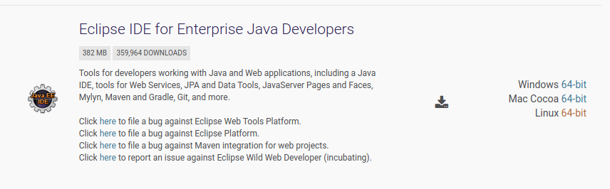
  
### 2.3 Download Javafx SDK
-  Bản mới nhất hiện tại là version 15, có thể download tại [download link](https://gluonhq.com/products/javafx/)
-  Lưu ý cài các bản có chữ `SDK` ở cuối của cột `Product` và cần cài theo hệ điều hành đang sử dụng
-  Sau khi tải về thành công sẽ được một file có dạng `openjfx-15-***.zip` (*** là tên hệ điều hành)
  
    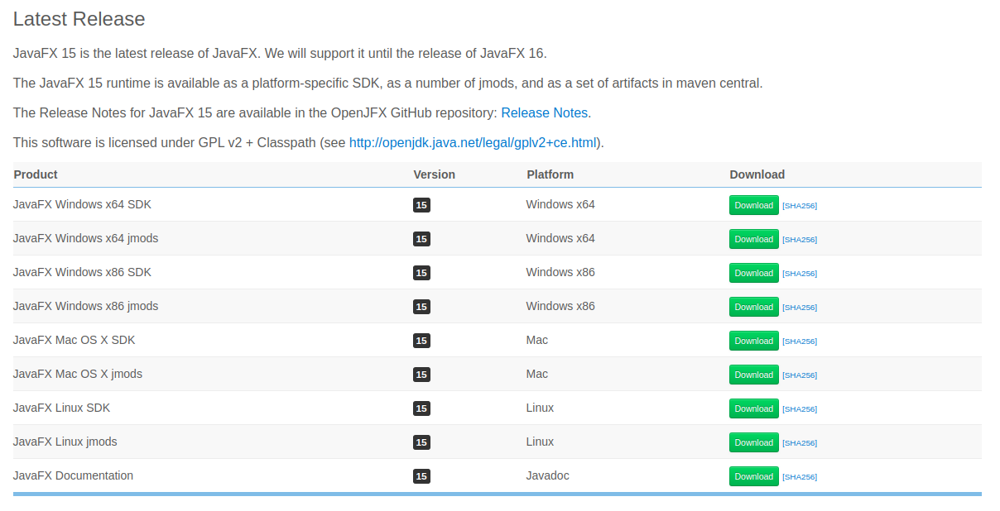

## 3. Làm quen với JavaFx
### 3.1 Các thuật ngữ sử dụng của JavaFx

- **Stage** (Window) là khung chứa tất cả các đối tượng của một ứng dụng, hay chúng ta có thể hiểu Stage là cửa sổ ngoài cùng của một giao diện 
- **Scene** là thành phần được đặt nằm trong Stage và là thành phần chứa các đối tượng cụ thể như Button, Layout,.. . Mỗi scene thì được gắn với duy nhất một Stage
- **Node** là các đối tượng cụ thể của ứng dụng như: Button, CheckBox, Layout,...
  
    

### 3.2 Các loại packages của JavaFx
- **javafx.animation:** chứa một tập các class cung cấp các loại animation như: xoay(rotate), dịch chuyển (transition), ..
- **javafx.application:** chứa một tập các class chịu trách nhiệm quản lý vòng đời của ứng dụng
- **javafx.css**: chứa các class hỗ trợ cho việc thêm CSS vào ứng dụng
- **javafx.event:** chứa các class và giao diện để truyền và xử lý các sự kiện
- **javafx.geometry:** chứa các class dùng để định nghĩa ra các đối tượng 2D và thực hiện các thao tác trên chúng
- **javafx.stage:** là package chứa các class container bên ngoài cùng của ứng dụng
- **javafx.scene:** là package cung cấp các class và giao diện hỗ trợ cho các thành phần như canvas, layout, chart, media, image, ...

### 3.3 Các loại đối tượng cơ bản trong JavaFx
-  **Containers:** 
   - Container là các loại đối tượng tạo ra nhằm mục đích chứa các loại đối tượng khác  
   - Các loại container phổ biến: `Anchor Pane`, `Tab Pane`, `VBox`, `HBox`, `Pane`
     
     +  `Anchor Pane`: là container cơ bản dùng để chứa các thành phần khác
     +  `VBox`: là một loại layout dùng để chứa các đối tượng theo hàng dọc
     +  `HBox`: là môt loại layout dùng đê chứa các đối tượng theo hàng ngang 
     
        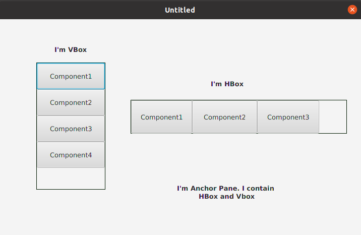

     +  `Tab Pane`: là một loại Pane và có thêm thanh công cụ bên trên (các tabs)
  
        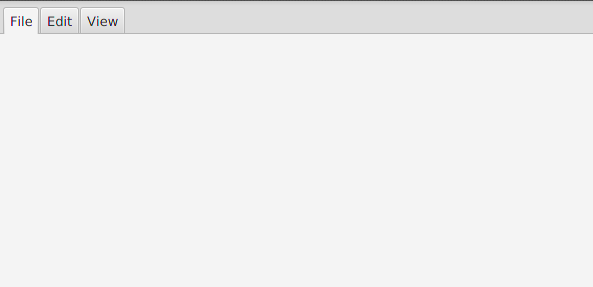

- **Controls:**
  - Là các loại đối tượng cụ thể của ứng dụng như: `Button`, `Label`, `ImageView`, `CheckBox`, `ChoiceBox`, `TextField`,.. 
    - `Button`: là các nút điều khiển
    - `Label`: là đối tượng chứa nhãn dạng text
    - `ImageView`: hiển thị hình ảnh
    - `CheckBox`: cho phép tùy chọn 1 hoặc nhiều options
    - `ChoiceBox`: lựa chọn 1 option duy nhất
    - `TextField`: chứa text
  
      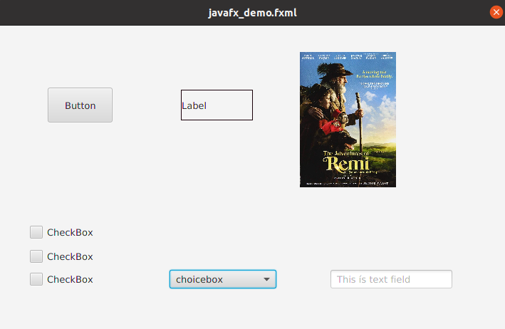


## 4. Tạo chương trình JavaFx HelloWorld
- Mở Eclipse, sau đó tạo một Java project với tên `HelloJavaFx` và bên trong `src` folder tạo môt file `HelloJFX.java`
  
  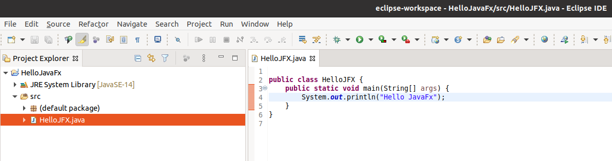

- Tạo một thư mục `lib` cùng cấp với thư mục `src`, thư mục `lib` được tạo ra với mục đích chứa các thư viện được sử dụng ở trong project nhằm giúp cho thuận tiện cho việc quản lý các dependencies cho cá nhân và các thành viên trong project
- Giải nén file zip JavaFx JDK đã tải từ các bước bên trên vào thư mục `lib`
  
  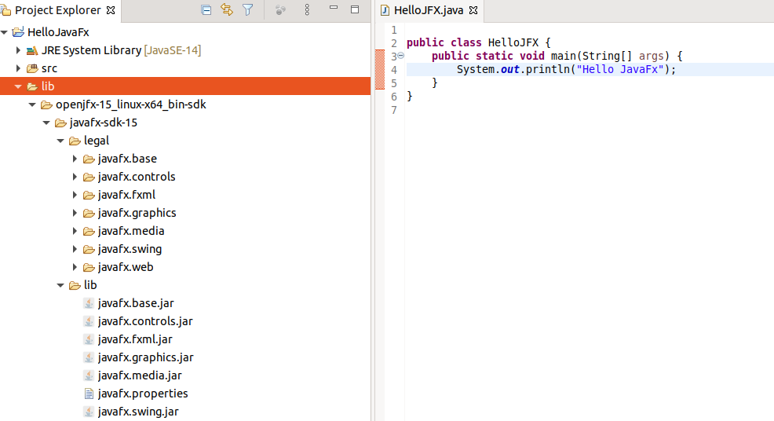

- Click chuột phải vào Project > Build Path > Configure Build Path

  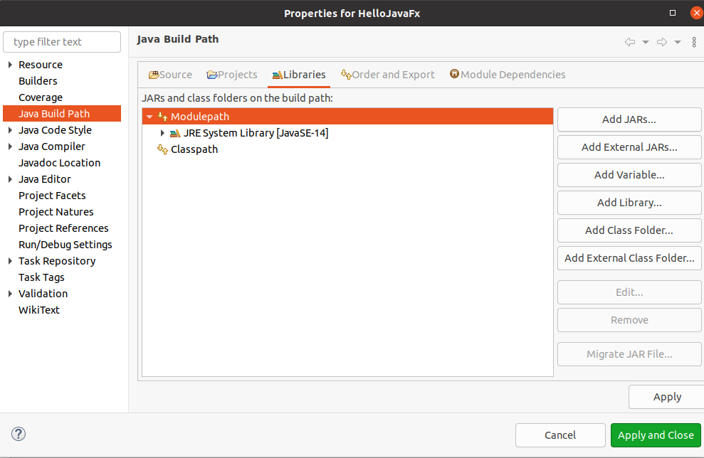

- Click chuột lên `Modulepath` hoặc `Classpath` > Add Library > User Library > click `Next` > User Libraries

  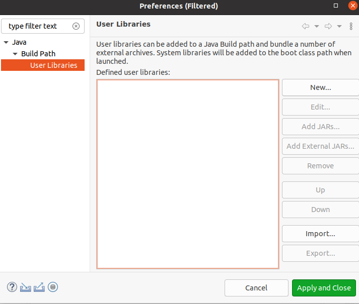

- Click `New` > Nhập user library name là `javafx` > click `Ok`

  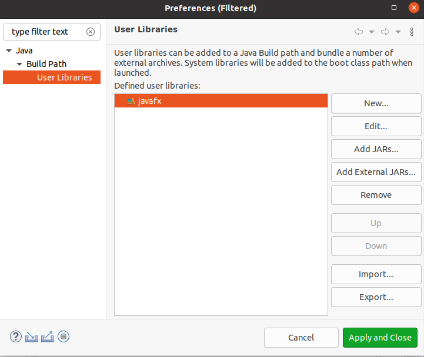

- Click `Add External JARs`
- Browse đến thư mục `lib` của project có chứa JavaFx JDK đã giải nén và vào tiếp đến thư mục `lib` của JavaFx JDK
- Chọn hết tất cả các file jar

  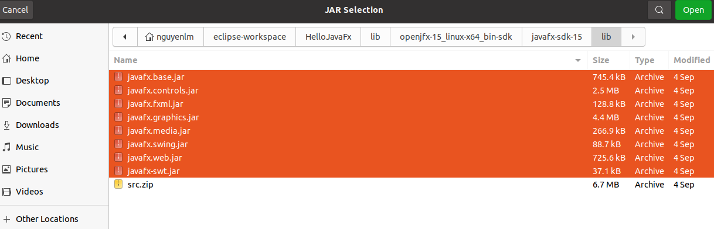

- Click Open > Apply and Close > Tick chọn `javafx` > Finish > Apply and Close
- Nếu thực hiện các bước trên thành công thì sẽ được kết quả như bên dưới

  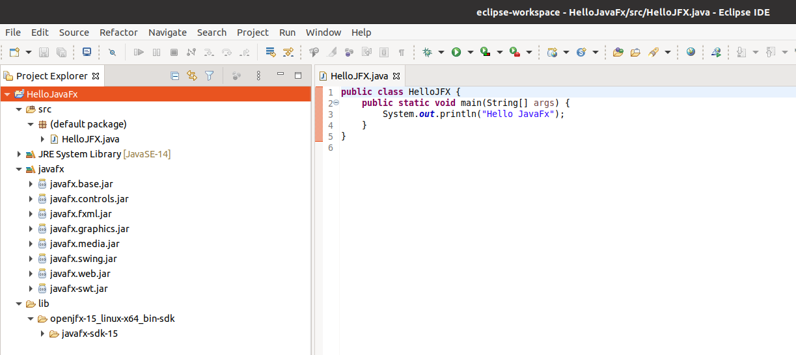

- Đến đây thì bạn có thể lập trình ứng dụng JavaFx HelloWorld mà không bị lỗi compile do thiếu thư viện
- Paste đoạn code dưới đây vào Eclipse

  ```java
    import javafx.application.Application;
    import javafx.scene.Scene;
    import javafx.scene.control.Label;
    import javafx.scene.layout.StackPane;
    import javafx.stage.Stage;

    public class HelloJFX extends Application {

        @Override
        public void start(Stage stage) {
            String javaVersion = System.getProperty("java.version");
            String javafxVersion = System.getProperty("javafx.version");
            Label l = new Label("Hello, JavaFX " + javafxVersion + ", running on Java " + javaVersion + ".");
            Scene scene = new Scene(new StackPane(l), 640, 480);
            stage.setScene(scene);
            stage.show();
        }

        public static void main(String[] args) {
            launch();
        }

    }
  ```
- Đến đây nếu bạn bấm Run thì chương trình chương trình vẫn chưa thể chạy ứng dụng thành công và báo lỗi sau đây
  
  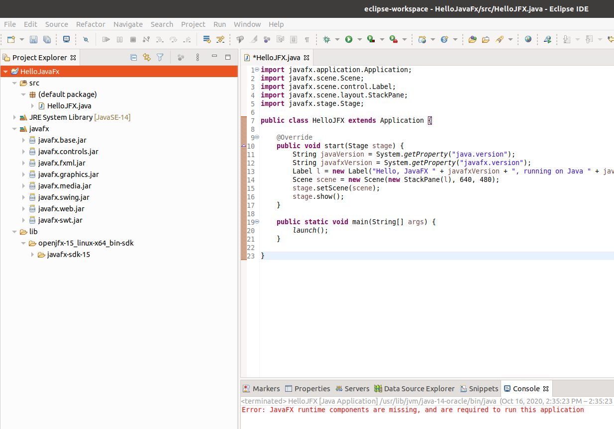

- Để có thể thực hiện chạy chương trình thành công thì cần thêm một bước config
- Tiếp theo Click và `Run` > Run Config > Vào tab `Arguments` 
- Paste đoạn text dưới đây vào `VM arguments`
  ```
  --module-path lib/openjfx-15_linux-x64_bin-sdk/javafx-sdk-15/lib/ --add-modules javafx.controls,javafx.fxml
  ```
- Bấm `Run` và xem kết quả
  
  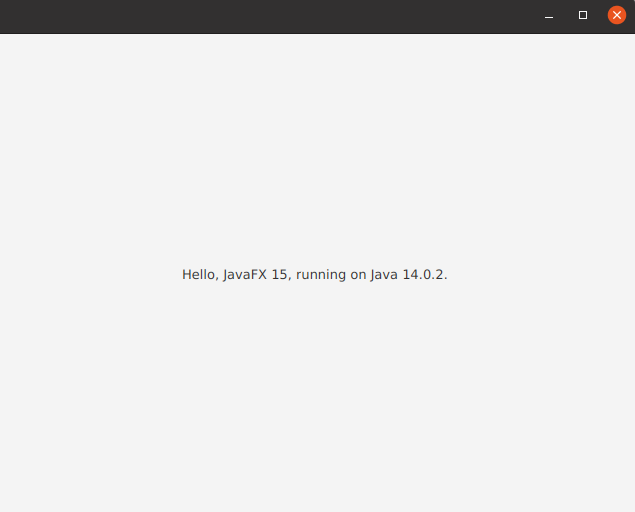

- Lưu ý là mình đang dùng hệ điều hành linux nên tên folder JavaFx JDK và đường dẫn đến thư mục `lib` khác một chút so với Mac và Window. Các bạn điều chỉnh lại một chút theo hệ điều hành mình dùng
- Đến đây thì bạn đã có thể compile và run chương trình một cách thành công ^-^

### P/S: Vậy đến đây là chúng ta đã kết thúc việc làm quen với JavaFX và chạy được một chương trình Hello World JavaFX đơn giản, cũng không khó lắm nhỉ :wink:. Chúc các bạn học tập chăm chỉ và thành công.